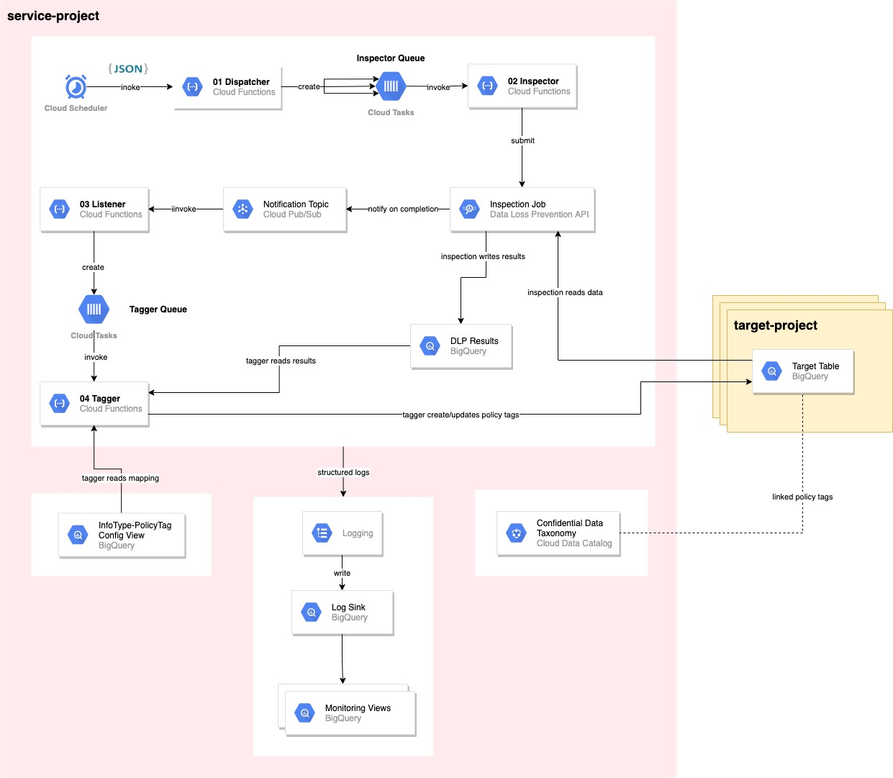
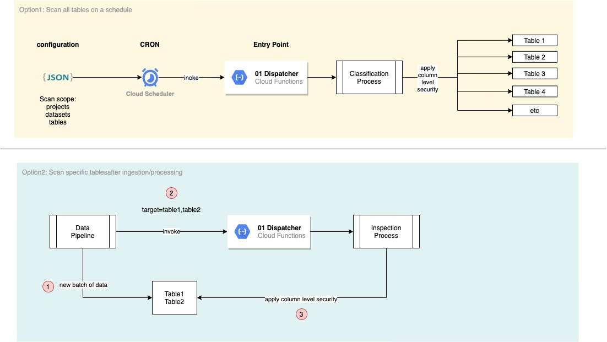
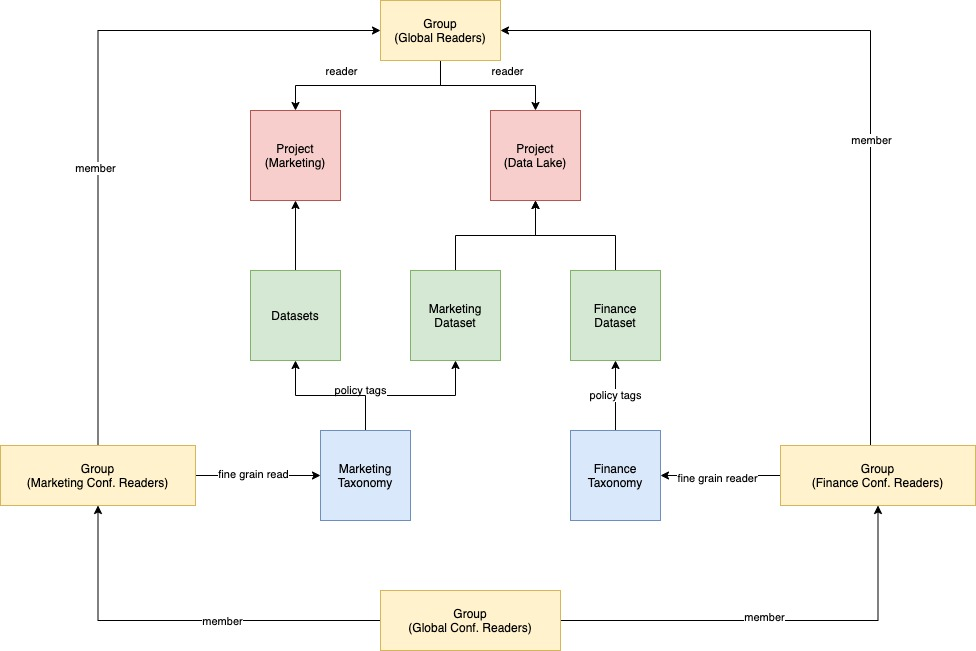

# BigQuery PII Classifier

## Table of Contents
1. [Overview](#overview)
2. [Architecture](#architecture)
3. [Configuration](#configuration)
4. [Deployment](#deployment)
5. [Configure Data Projects](#configure-data-projects)
6. [Reporting](#reporting)
7. [Updating DLP Info Types](#updating-dlp-info-types)
8. [GCP rate limiting](#gcp-rate-limiting)
9. [Use cases](#use-cases)  
10. [IAM Model Example](#iam-model-example)


## Overview

This a solution to automate the process of discovering and tagging
PII data across Bigquery tables and applying column level access controls to restrict access to 
specific PII data types to certain users/groups.

Main Steps:

1. *Configure PII Taxonomy and User Access:*  
   Declare taxonomy for PII (e.g. email, addresses, phone number etc.)which can be modified and extended by customers to allow for custom PII types. 
2. *Inspect BigQuery Tables:*  
   Scan & automatically discover PII data based on the defined data classification taxonomy
3. *Tag Columns:*  
   Applying access-control tags to columns in accordance with data classification 
4. *Restrict Access:*  
   Limit PII data access to specific groups (e.g. Marketing PII Readers) based on data classification 

## Architecture



### High level technical flow
* Define a BigQuery scan scope (i.e. inclusion/exclusion lists of projects, datasets and tables)
* Call an entry point Cloud Function with the scan scope
* Cloud function lists BigQuery tables within the scan scope
* For each listed table
  * Create a DLP Inspection Job
  * Read DLP inspection results from BigQuery
  * For each column in the table
    * Determine a single InfoType from the DLP results
    * Apply a policy tag to the column that maps to this InfoType

### Components
*Dispatcher Function*  
A Cloud Function that acts as the entry point for the solution. It expects a BigQuery scanning scope expressed as inclusion and exclusion lists of projects, datasets and tables. This scope could be one or more tables.

The Dispatcher will call the BigQuery API to list all tables included in the scan scope and submit a DLP Inspection task for that table in the Inspector Queue.

*Inspector Queue*  
This queue decouples the Dispatcher function from the Inspector function in order to handle the rate limits of the DLP API and to apply auto-retries with backoffs.

The Inspector Queue is configured via Terraform to dispatch requests to the Inspector Function at a rate that doesn’t overwhelm the DLP API.

*Inspector Function*  
The Inspector Function expects a request to scan one table. It will submit an Inspection job to DLP for that table according to the configured Inspection template and other parameters such as scan limits, results table, notifications topic, etc.

For cost control, the function will limit the number of rows to be scanned based on the table size and a user defined configuration that determines limit intervals (e.g. 0-1000 rows → sample 100, 1001-10000 → sample 500, etc). This sample will be taken randomly from the table.

*DLP Notifications Topic*  
A PubSub topic to receive notifications once a DLP inspection job is completed. This allows us to use an asynchronous flow and not wait for the inspection job to complete.

*Listener Function*  
A Cloud Function to receive the PubSub message generated by the DLP API. The function will submit a Tagging task for one table  to the Tagger Queue.

*Tagger Queue*  
This queue decouples the DLP API notifications  from the Tagger function in order to handle the rate limits of BigQuery column tagging operations  and to apply auto-retries with backoffs.

*Tagger Function*  
A Cloud Function that expects the information of the DLP scan results of one BigQuery table. It will determine the final InfoType of each column and apply the appropriate  Policy Tag as defined in the InfoType - Policy Tags mapping.

*BigQuery Config Views*  
Terraform will generate config views based on the defined  mappings and configurations. These config views are mainly used by the Tagger function to determine the policy tagging logic.

*Logs*  
All Cloud Functions are writing structured logs that are exported by a log sink to BigQuery. On top of that there are a number of BigQuery views that help in monitoring and debugging call chains and tagging actions on columns.


## Configuration

The solution is deployed by Terraform and thus all configurations are done
on the Terraform side.

### Create a Terraform .tfvars file

Create a new .tfvars file and override the variables

```
export VARS=my-variables.tfvars
```

### Configure Basic Variables

Most required variables have default names defined in [variables.tf](terraform/variables.tf).
You can use the defaults or overwrite them in the .tfvars file you just created.

Both ways, you must define the below variables:

```
project = "<GCP project ID to deploy solution to>"
region = "<GCP region>"
```

PS: Cloud tasks queues can't be re-created with the same name
after deleting them. If you deleted the queues (manually or via Terraform), you must provide
new names other than the defaults otherwise Terraform will fail to deploy them.

### Configure Scanning Scope

Override the following variables to define the scanning scope of the entry point Cloud Scheduler.

At least one variable should be provided among the _INCLUDE configs.

tables format: "project.dataset.table1, project.dataset.table2, etc"
datasets format: "project.dataset, project.dataset, etc"
projects format: "project1, project2, etc"

```
tables_include_list = ""
datasets_include_list = ""
projects_include_list = ""
datasets_exclude_list = ""
tables_exclude_list = ""
```
### Configure Data Classification Taxonomy

A mapping between DLP InfoTypes, policy tags and classifications.
Classifications are parent nodes in the taxonomy to group children nodes.

This will enable the solution:
 * Build hierarchical policy tag taxonomies
 * To identify which policy tag to apply to a column based on the PII/InfoType discovered

PS: INFO_TYPEs configured in the [DLP inspection job](terraform/modules/dlp/main.tf) 
MUST be mapped here. Otherwise, mapping to policy tag ids will fail

```

classification_taxonomy = [
  {
    info_type = "EMAIL_ADDRESS",
    policy_tag = "email",
    classification = "High"
  },
  {
    info_type = "PHONE_NUMBER",
    policy_tag = "phone"
    classification = "Low"
  },

  .. etc
  ]
```

### Configure Domain Mapping

A one-to-one mapping between GCP projects and/or BigQuery datasets and domains.
Domains are logical groupings that determine access control boundaries. For example, if  “Marketing” and “Finance” are domains this means that marketing PII readers can only read their PII data but can’t read finance PII data.

For each configured “domain” a corresponding taxonomy will be generated in Cloud Data Catalog. Each taxonomy will contain the policy tags defined in InfoType - Policy Tag Mapping in the hierarchy defined in Terraform (adjustable)

You can define one domain per project that will be applied to all
BigQuery tables inside it. Additionally, you can overwrite this default project 
domain on dataset level (e.g. in case of a DWH project having data from different domains).


```
domain_mapping = [
  {
    project = "marketing-project",
    domain = "marketing"
  },
  {
    project = "dwh-project",
    domain = "dwh"
    datasets = [
      {
        name = "demo_marketing",
        domain = "marketing"
      },
      {
        name = "demo_finance",
        domain = "finance"
      }
    ]
  }
]
```
### Configure domain-IAM mapping

A mapping between domains/classifications and IAM users and/or groups. 
This will determine who has access to PII data under each domain and classification.

The keys of this Map are in the format "<domain>_<classification>"
and values are in the format "[list of IAM members]"

For users: "user:username@example.com"
For groups: "group:groupname@example.com"

For example:

```
iam_mapping = {
  marketing_High = ["group:marketing-high-pii-readers@example.com"],
  marketing_Low = ["group:marketing-low-pii-readers@example.com"],
  finance_High = ["user:finance-high-pii-reader@wadie.joonix.net"],
  finance_Low = ["user:finance-low-pii-reader@wadie.joonix.net"],
  dwh_High = ["group:marketing-high-pii-readers@example.com", "user:finance-high-pii-reader@wadie.joonix.net"],
  dwh_Low = ["group:marketing-low-pii-readers@example.com", "user:finance-low-pii-reader@wadie.joonix.net"]
}
```

### Configure DLP Service Account

* DLP service account must have Fine-Grained Reader role on the created taxonomies in order to inspect tagged columns for new data.
Steps:
 * Detect the DLP service account in the host project
     * DLP service account is in the form service-<project number>@dlp-api.iam.gserviceaccount.com
     * Search in IAM for @dlp-api.iam.gserviceaccount.com (tick the "Include Google-Provided role grants" box)
     * If this host project never used DLP before, run a sample inspection job for GCP to create a service account
 * Set the `dlp_service_account` variable in the terraform variables file

```
dlp_service_account = "service-<project number>@dlp-api.iam.gserviceaccount.com"

```

### Configure DryRun

By setting `is_dry_run = "True"` the solution will scan BigQuery tables 
for PII data, store the scan result, but it will not apply policy tags to columns.
Instead, the "Tagger" function will only log [actions](functions/bq_security_classifier_functions/src/main/java/com/google/cloud/pso/bq_security_classifier/functions/tagger/ColumnTaggingAction.java).

Check the Monitoring sections on how to access these logs.  

```
is_dry_run = "False"
```

### Configure Cloud Scheduler CRON

Configure the schedule on which the scan should take place.

PS: the current solution has one entry point/scheduler but one can extend the solution
by adding more schedulers that have different scanning scope and/or timing.

```
cron_expression = "0 0 * * *"
```

### Configure Table Scan Limits

This will define the scan limit of the DLP jobs when they inspect BigQuery tables. 
`limitType`: could be `NUMBER_OF_ROWS` or `PERCENTAGE_OF_ROWS`.
`limits`: key/value pairs of {interval_upper_limit, rows_to_sample}. For example,
`"limits": { "1000": "100" , "5000": "500"}` means that tables  with 0-1000
records will use a sample of 100 records, tables between 1001-5000 will sample 500 records
and tables 5001-INF will also use 500 records.

When using `PERCENTAGE_OF_ROWS` the rows_to_sample should be an integer between 1-100. For example,
20 means 20%.

```
table_scan_limits_json_config = "{\"limitType\": \"NUMBER_OF_ROWS\", \"limits\": {\"10000\": \"100\",\"100000\": \"5000\", \"1000000\": \"7000\"}}"
```

## Deployment

### Env setup
```
# project to deploy to
export PROJECT_ID=<> 
export REGION=europe-west2
export BUCKET_NAME=${PROJECT_ID}-bq-security-classifier
export BUCKET=gs://${BUCKET_NAME}
# gcloud & terraform config name
export CONFIG=<> 
# personal account
export ACCOUNT=<>  

gcloud config configurations create $CONFIG
gcloud config set project $PROJECT_ID
gcloud config set compute/region $REGION
gcloud config set account $ACCOUNT

gcloud auth login

gcloud auth application-default login
```

### GCP Set up

* Enable App Engine API in the project and create an application (for cloud tasks and scheduler to work)
* Enable APIs
  * Enable [Cloud Resource Manager API](https://console.cloud.google.com/apis/library/cloudresourcemanager.googleapis.com)
  * Enable [IAM API](https://console.developers.google.com/apis/api/iam.googleapis.com/overview)
  * Enable [Data Catalog API](https://console.developers.google.com/apis/api/datacatalog.googleapis.com/overview)
  * Enable [Cloud Tasks API](https://console.developers.google.com/apis/api/cloudtasks.googleapis.com/overview)
  * Enable [Cloud Functions API](https://console.developers.google.com/apis/api/cloudfunctions.googleapis.com/overview)


### Prepare Terraform 

* Create a bucket for Terraform state
```
gsutil mb -p $PROJECT_ID -l $REGION -b on $BUCKET
```

* Create a new .tfvars file and update the variables
```
export VARS=my-variables.tfvars
```

### Deploy via Terraform

* Set Terraform Service Account
  * Terraform needs to run with a service account to deploy DLP resources. User accounts are not enough.  

```
export TF_SA=sa-terraform

gcloud iam service-accounts create $TF_SA \
    --description="Used by Terraform to deploy GCP resources" \
    --display-name="Terraform Service Account"

gcloud projects add-iam-policy-binding $PROJECT_ID \
    --member="serviceAccount:${TF_SA}@${PROJECT_ID}.iam.gserviceaccount.com" \
    --role="roles/owner"

gcloud iam service-accounts add-iam-policy-binding \
    $TF_SA@$PROJECT_ID.iam.gserviceaccount.com \
    --member="user:${ACCOUNT}" \
    --role="roles/iam.serviceAccountUser"

gcloud iam service-accounts add-iam-policy-binding \
    $TF_SA@$PROJECT_ID.iam.gserviceaccount.com \
    --member="user:${ACCOUNT}" \
    --role="roles/iam.serviceAccountTokenCreator"
```

* Deploy solution

```
cd terraform

terraform init \
    -backend-config="bucket=${BUCKET_NAME}" \
    -backend-config="prefix=terraform-state"

terraform workspace new $CONFIG
# or
terraform workspace select $CONFIG

terraform plan -var-file=$VARS

terraform apply -var-file=$VARS -auto-approve

```

## Configure Data Projects

The application is deployed under a host project as set in the `PROJECT_ID` variable.
To enable the application to scan and tag columns in other projects (i.e. data projects) one must grant a number of
permissions on each data project. To do, run the following script for each data project:

PS: update the SA emails if the default names have been changed

```
export DATA_PROJECT=<>
export SA_DISPATCHER_EMAIL=sa-sc-dispatcher@${PROJECT_ID}.iam.gserviceaccount.com
export SA_INSPECTOR_EMAIL=sa-sc-inspector@${PROJECT_ID}.iam.gserviceaccount.com
export SA_TAGGER_EMAIL=sa-sc-tagger@${PROJECT_ID}.iam.gserviceaccount.com
export SA_DLP_EMAIL=service-$PROJECT_NUMBER0@dlp-api.iam.gserviceaccount.com

./scripts/prepare_data_projects.sh "${DATA_PROJECT}" $SA_DISPATCHER_EMAIL $SA_INSPECTOR_EMAIL $SA_TAGGER_EMAIL $SA_DLP_EMAIL
```


## Reporting

Get the latest run_id

```
SELECT MAX(run_id) max_run_id, TIMESTAMP_MILLIS(CAST(SUBSTR(MAX(run_id), 3) AS INT64)) AS start_time, FROM `bq_security_classifier.v_steps`

```

Monitor each invocation of Cloud Functions

```
SELECT * FROM `bq_security_classifier.v_steps` WHERE run_id = 'R-1631537508737'

```

Monitor failed runs (per table)

```
SELECT * FROM `bq_security_classifier.v_broken_steps` WHERE run_id = 'R-1631537508737'

```

Monitor column tagging activities

```
SELECT th.start_time,
th.run_id,
th.tracker,
th.project_id,
th.dataset_id,
th.table_id,
th.field_id,
 m.info_type,
 th.existing_policy_tag,
 th.new_policy_tag,
 th.operation,
 th.details
 FROM `bq_security_classifier.v_log_tag_history` th
INNER JOIN `bq_security_classifier.v_config_infotypes_policytags_map` m
ON th.new_policy_tag = m.policy_tag
WHERE run_id = 'R-1631537508737'
ORDER BY tracker


```

## Updating DLP Info Types
Steps to add/change an InfoType:
* Add InfoType to the [inspection_template](terraform/modules/dlp/main.tf)
* In your .tfvars file Add a mapping entry to variable infoTypeName_policyTagName_map (info type to policy tag name)
e.g. {info_type = "EMAIL_ADDRESS", policy_tag = "email"}
* Apply terraform (will create/update the inspection template)


## GCP rate limiting
Inspector Function:
* DLP: 600 requests per min --> DISPATCH_RATE = 10 (per sec)
* DLP: 1000 running jobs --> handle via retries since creating jobs is async

Tagger Function:
* Maximum rate of dataset metadata update operations (including patch) 
* 5 operations every 10 seconds per dataset --> DISPATCH_RATE = 1 (per sec)
 (pessimistic setting assuming 1 dataset)(rely on retries as fallback)

Cloud Tasks Configurations:
 DISPATCH_RATE is actually the rate at which tokens in the bucket are refreshed. In conditions where there is a relatively steady flow of tasks, this is the equivalent of the rate at which tasks are dispatched.
 MAX_RUNNING is the maximum number of tasks in the queue that can run at once.
 
 
 ## Use cases
 
 After deploying the solution, one can call it in different ways:
 
 
 
 **[Option 1] Inventory Scans:**    
 
 In this scenario, a BigQuery scan scope is defined to include several projects, datasets and tables to be inspected and tagged once or on a regular schedule. This could be done by using Cloud Scheduler (or any Orchestration tool) to  invoke the Dispatcher Function with such scan scope and frequency.  
 
 In addition, more than one Cloud Scheduler/Trigger could be defined to group tables that have the same inspection schedule (daily, monthly, etc)
 
 **[Option 2]  Immediate Scans:**
 
 Within a data pipeline that populates X number of tables, one could invoke the HTTP Dispatcher function with a list of only these tables after the data load step. This could be done from the ETL or the orchestration tool used.
 
 Alternatively, one could listen to certain log-events on GCP via log sinks (e.g. BigQuery table load, Dataflow job completion) and trigger the Dispatcher Function to inspect and tag the concerned table/tables.

 
  ## IAM Model Example
  
  
 
 ## Solution Limits
 
General limits:
  * Supports 1 GCP region only: 
  A table must be in the same GCP region as the taxonomy in order to use its policy tags. If tables
  span multiple regions, the solution must be extended to create replicas of the taxonomies in other regions
  and include them in the InfoType to policy tag mapping views created by Terraform.
  
  * Supports Cloud Function `Allow All Traffic` mode only:  
  The solution is using serverless products like Cloud Functions, Cloud Tasks, PubSub and Cloud Scheduler.
  In order for Cloud Functions to communicate with the rest of these products it must be deployed with 
  `Allow All Traffic` mode ([see Ingress settings.](https://cloud.google.com/functions/docs/networking/network-settings#ingress_settings)) 
  . This network setting doesn't mean that the functions are open, they will still be secured by requiring authentication.
  To work with `Allow internal traffic only` and accepting traffic originating only from VPC networks in the same project or VPC Service Controls perimeter;
  the solution must be re-designed without the use of Cloud Tasks, PubSub and Cloud Scheduler. 
 
 [Data Catalog Limits:](https://cloud.google.com/data-catalog/docs/resources/quotas)
 * 40 taxonomies per project --> 40 domains to configure in the domain mapping (1 taxonomy per domain)
 * 100 policy tags per taxonomy --> 100 data classifications and DLP types to scan for
 
 [BigQuery Limits:](https://cloud.google.com/bigquery/quotas)
 * 1 policy tag per column --> One column could be identified as only one DLP InfoType.
 